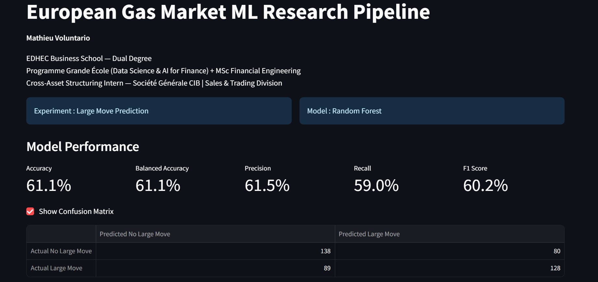
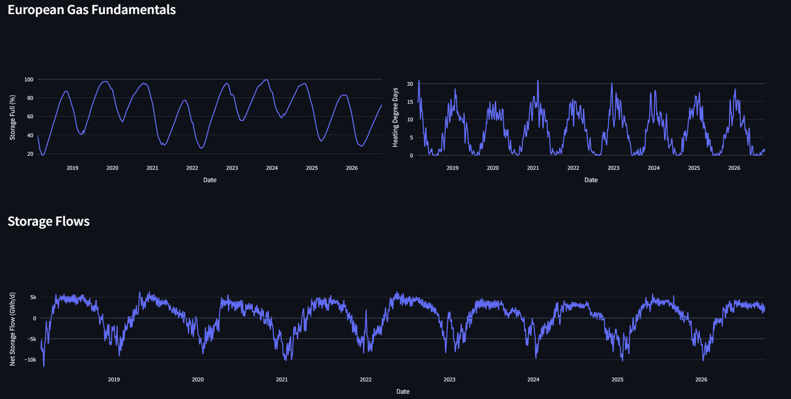
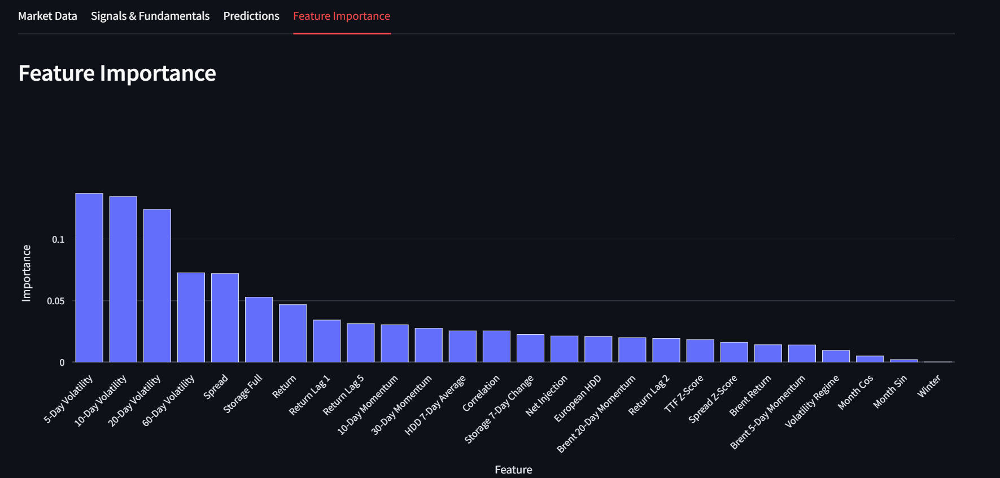

# European Gas Market ML Research Pipeline

Machine learning research project focused on the European natural gas market, combining market data, quantitative signals and fundamental gas-market indicators to study TTF price behaviour.



## Overview

The pipeline investigates several forecasting problems:

- Next-day TTF direction
- 5-day TTF direction
- Large price move detection
- High-volatility regime detection

The objective is not to build a perfect directional forecasting model, but to evaluate where market and fundamental variables provide useful predictive information.

## Data & Features

The model combines:

**Market data**
- TTF Natural Gas
- Brent Crude Oil

**Quantitative signals**
- Returns and lagged returns
- Multi-horizon volatility
- Momentum
- TTF / Brent spread
- Rolling correlation
- Z-scores
- Volatility regimes

**European gas fundamentals**
- EU gas storage level
- 7-day storage change
- Net storage flows
- European Heating Degree Days (HDD)
- 7-day average HDD
- Seasonal indicators

Storage data is sourced from GIE AGSI+ and historical weather data from Open-Meteo.



## Models

The research pipeline compares:

- Random Forest
- Gradient Boosting
- Logistic Regression

Training and testing are performed chronologically to preserve the time-series structure and reduce look-ahead bias.

## Key Results

Using the 10-year historical window, Random Forest produced the strongest overall results:

| Research Target | Balanced Accuracy |
|---|---:|
| Next-Day Direction | 51.5% |
| 5-Day Direction | 53.4% |
| Large Move Detection | 61.1% |
| High Volatility Detection | 73.8% |

The results suggest that short-term directional forecasting remains difficult, while market volatility, storage conditions and weather-related demand variables provide more useful information for identifying large moves and high-volatility regimes.

Feature importance analysis shows that short-term volatility measures remain the main drivers of large-move predictions, while European storage levels and HDD indicators provide additional fundamental information.



## Dashboard

The Streamlit application allows users to:

- Select the research experiment
- Compare ML models
- Change the historical window
- Explore TTF and Brent prices
- Monitor gas fundamentals and quantitative signals
- Visualize predicted probabilities
- Analyse model feature importance

## Tech Stack

`Python` · `Pandas` · `NumPy` · `Scikit-Learn` · `Plotly` · `Streamlit` · `yfinance`

## Run Locally

```bash
pip install -r requirements.txt
streamlit run app.py
